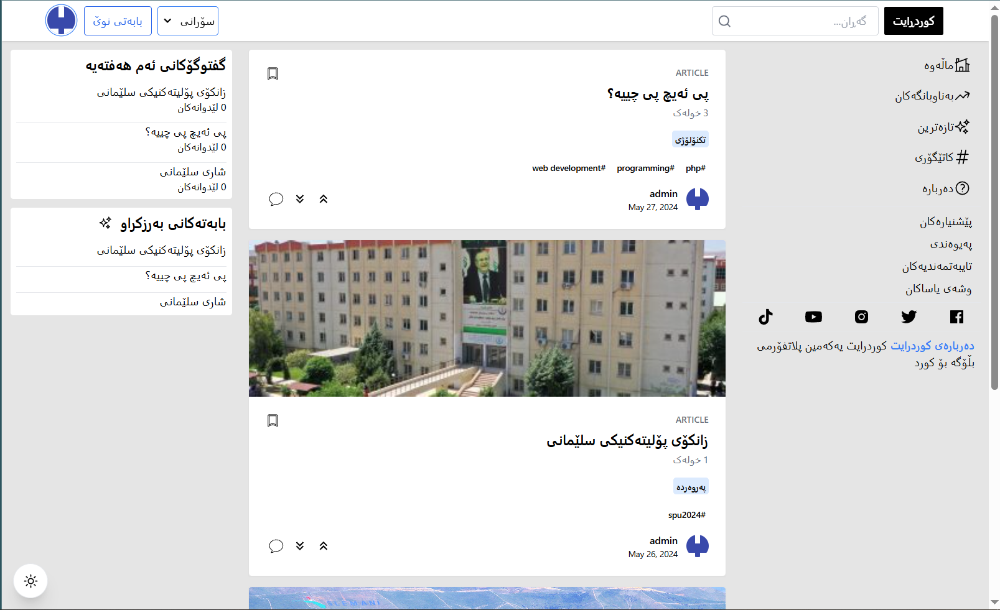
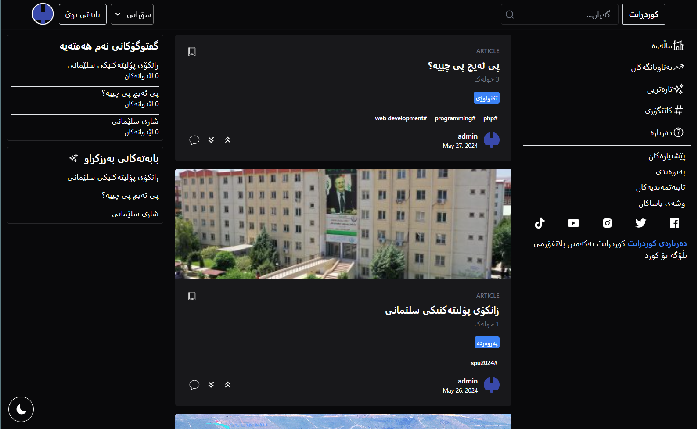
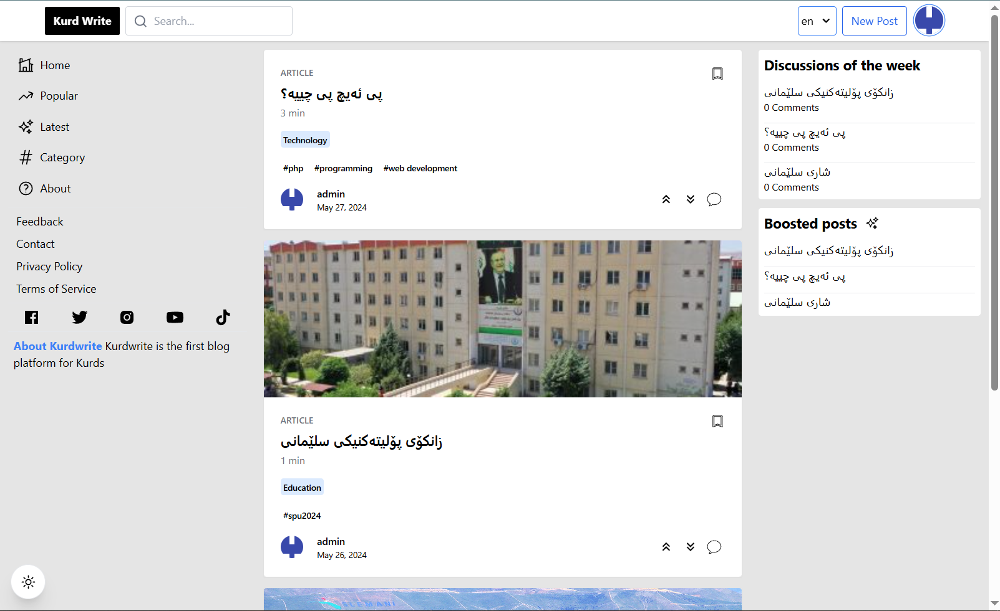
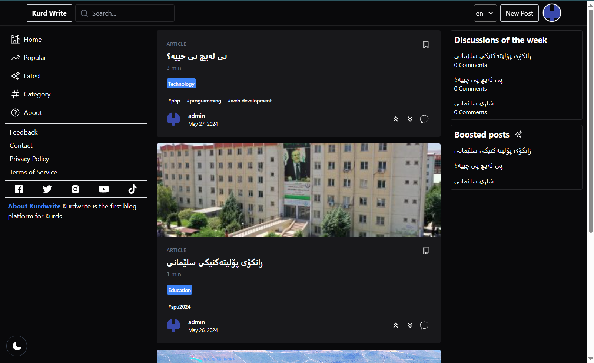
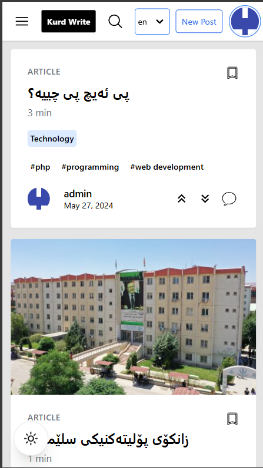
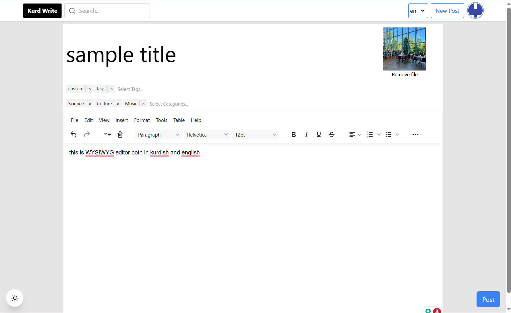
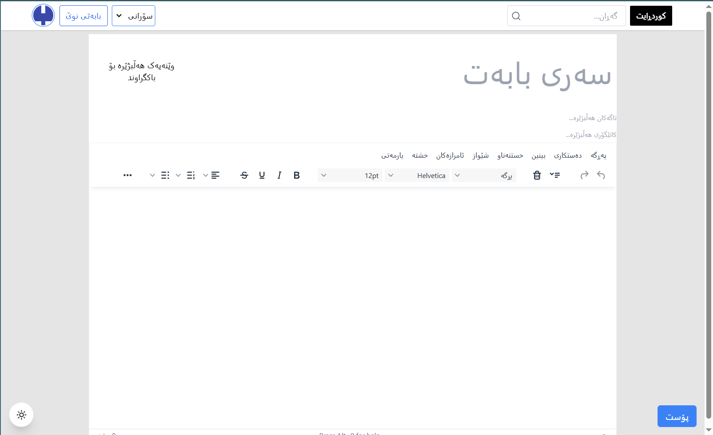
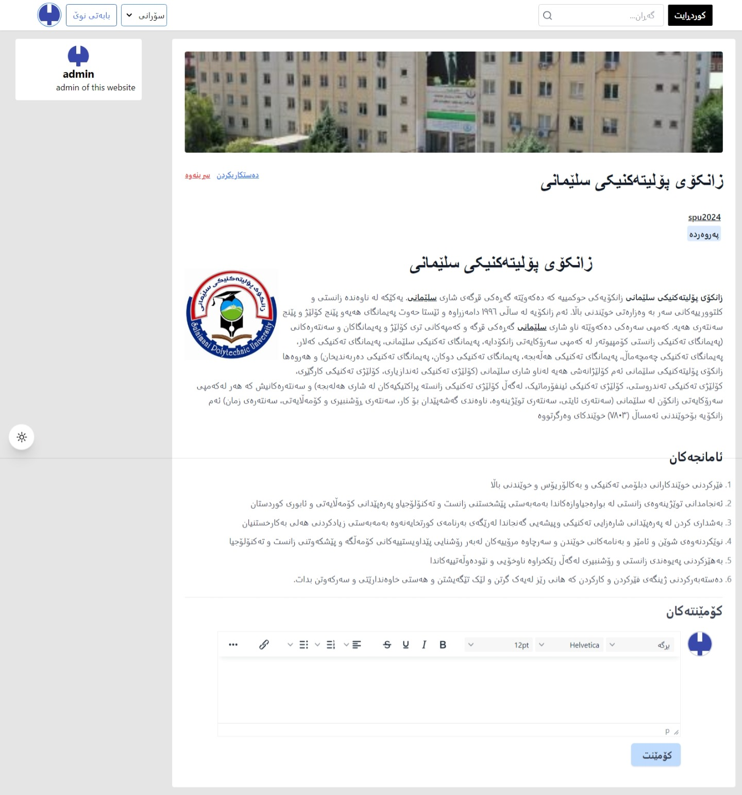
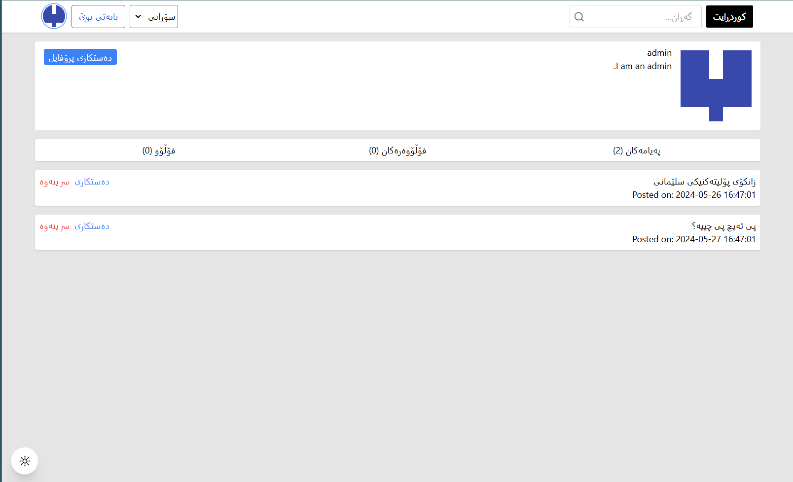

# Kurdwrite showcase
# a showcase of graduate project from college. 

## Note: the project has been sold therefore the code cannot be shown 

## this Project was made with Laravel, tailwindcss, alpine js, and htmx

## on the home page i have devided the screen into 3 columns, one is for the navigation, middle for the articles users create and other for most popular articles in the last 7 days as well as any boosted posts we would like to show

## home page in dark mode

## in English

## in mobile design

## here is how the new content page would look like, the tags can be created on the fly while the categories are fixed

## and images optionally can be uploaded for the header of the post

## the body utilizes the TinyMCE WYSIWYG editor for a richer experience 

## here is how the articles would look like once clicked on

## this is the dashboard of the user, which can show the username, about me, and list of post they made as well list of user they follow and their followers 
