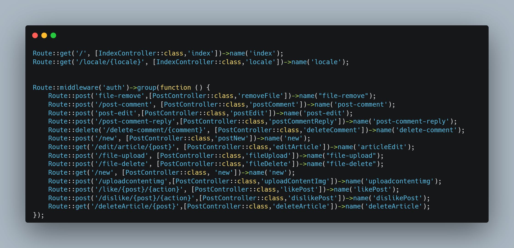
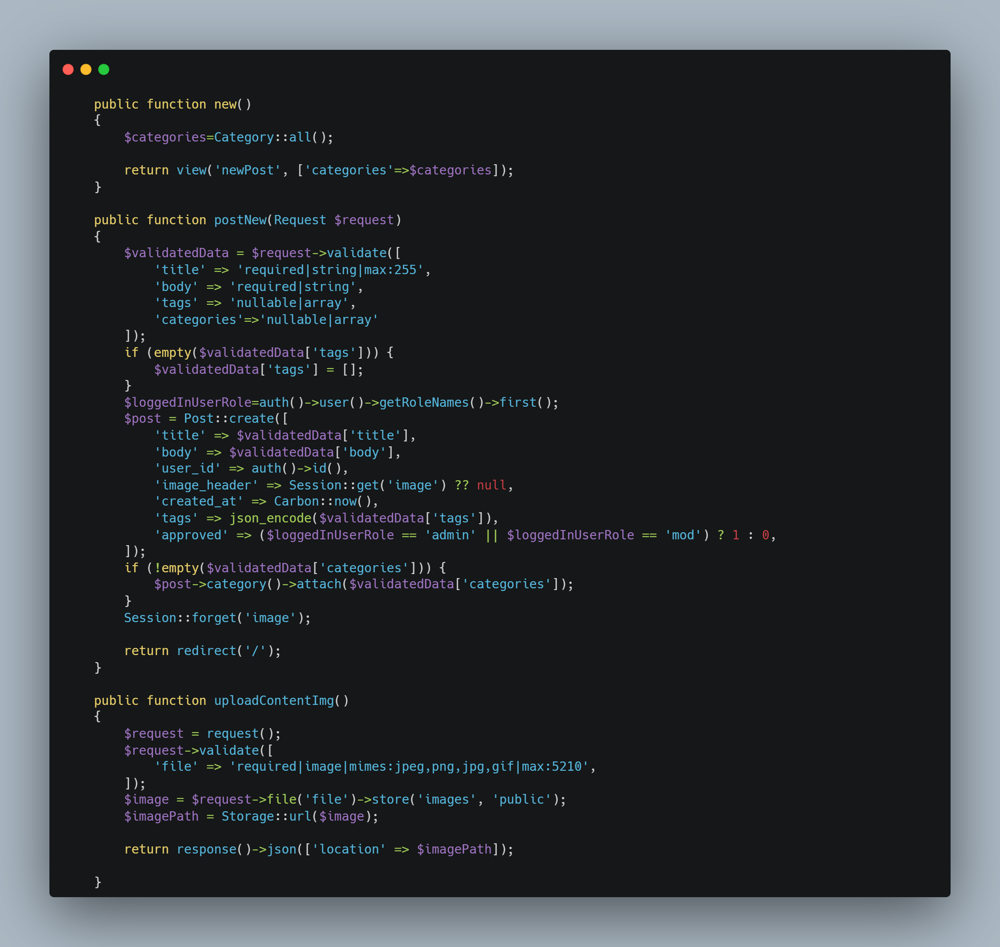

# Kurdwrite showcase
## a showcase of graduate project from college. 

 Note: the project has been sold therefore the code cannot be shown 

 ### This project was made with Laravel, tailwindcss, alpine js, and htmx

## On the home page we have divided the screen into 3 columns, one is for the navigation, the middle is for the articles users create, and other is for the most popular articles in the last 7 days as well as any boosted posts we would like to show

## home page in dark mode

## in English

## in mobile design

## here is how the new content page would look like, the tags can be created on the fly while the categories are fixed

## and images optionally can be uploaded for the header of the post

## the body utilizes the TinyMCE WYSIWYG editor for a richer experience 

## Here is how the articles would look like once clicked on

## This is the dashboard of the user, which can show the username, about me, and list of post they made as well list of user they follow and their followers 

## snippet of the routes of the application utilizing the MVC pattern 

## snippet of the controller 
